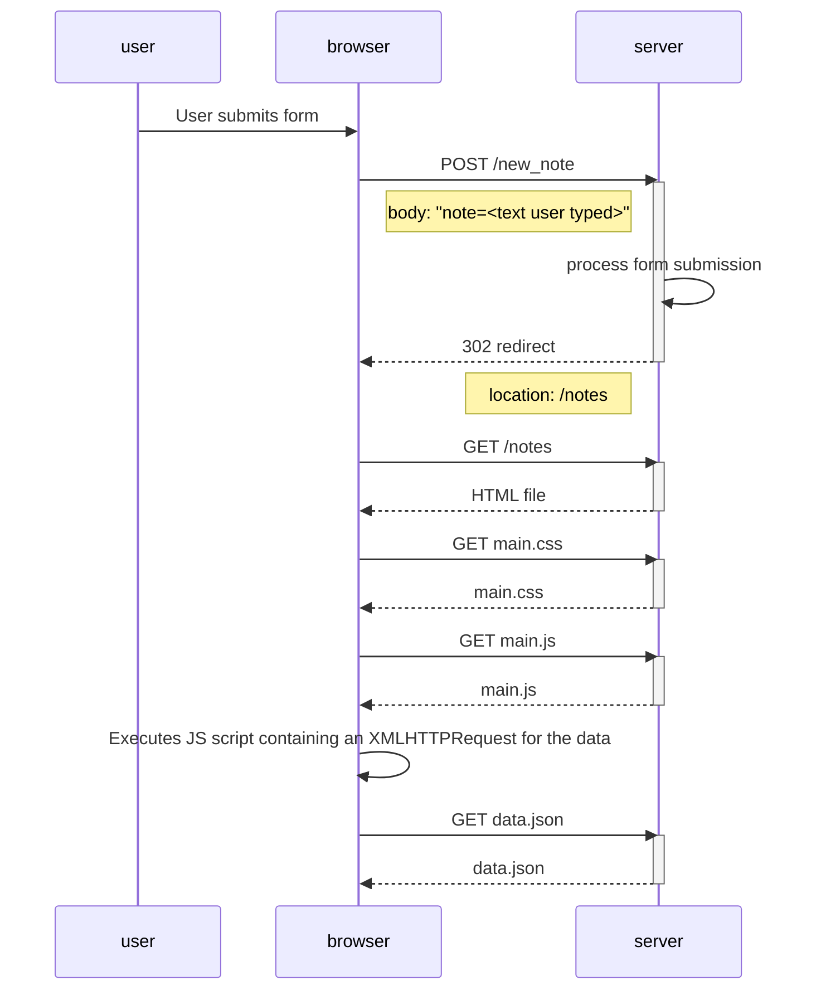

# 0.4: New note diagram

This is the sequence diagram for the submission of the form using traditional HTML API

```mermaid
sequenceDiagram
participant user
participant browser
participant server

user->>browser: User submits form
browser->>server: POST /new_note
activate server
Note right of browser: body: "note=<text user typed>"
server->>server: process form submission
server-->>browser: 302 redirect
deactivate server
Note left of server: location: /notes

browser->>server: GET /notes
activate server
server-->>browser: HTML file
deactivate server

browser->>server: GET main.css
activate server
server-->>browser: main.css
deactivate server

browser->>server: GET main.js
activate server
server-->>browser: main.js
deactivate server

browser->>browser: Executes JS script containing an XMLHTTPRequest for the data

browser->>server: GET data.json
activate server
server-->>browser: data.json
deactivate server

```
