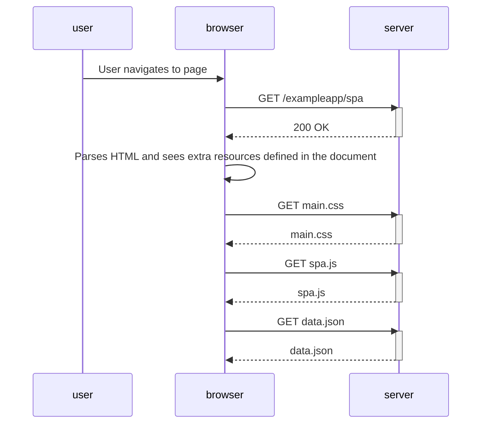

# 0.5: Single page app diagram

This is the sequence diagram for the access of the webpage using SPA technology.

```mermaid
sequenceDiagram
participant user
participant browser
participant server

user->>browser: User navigates to page
browser->>server: GET /exampleapp/spa
activate server
server-->>browser: 200 OK
deactivate server

browser->>browser: Parses HTML and sees extra resources defined in the document

browser->>server: GET main.css
activate server
server-->>browser: main.css
deactivate server

browser->>server: GET spa.js
activate server
server-->>browser: spa.js
deactivate server

browser->>server: GET data.json
activate server
server-->>browser: data.json
deactivate server

```
