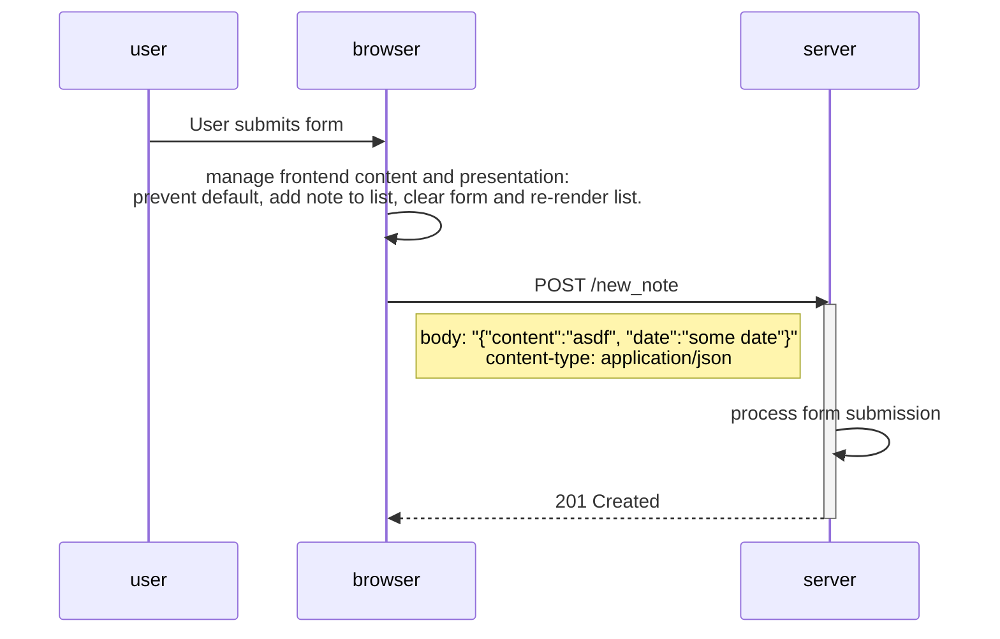

# 0.5: Single page app diagram

This is the sequence diagram for the submission of the form using SPA-style techniques

```mermaid
sequenceDiagram
participant user
participant browser
participant server

user->>browser: User submits form
browser->>browser: manage frontend content and presentation: <br> prevent default, add note to list, clear form and re-render list.
browser->>server: POST /new_note
activate server
Note right of browser: body: "{"content":"asdf", "date":"some date"}" <br> content-type: application/json
server->>server: process form submission
server-->>browser: 201 Created
deactivate server

```
